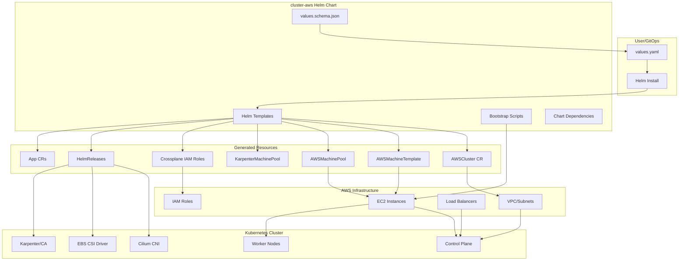
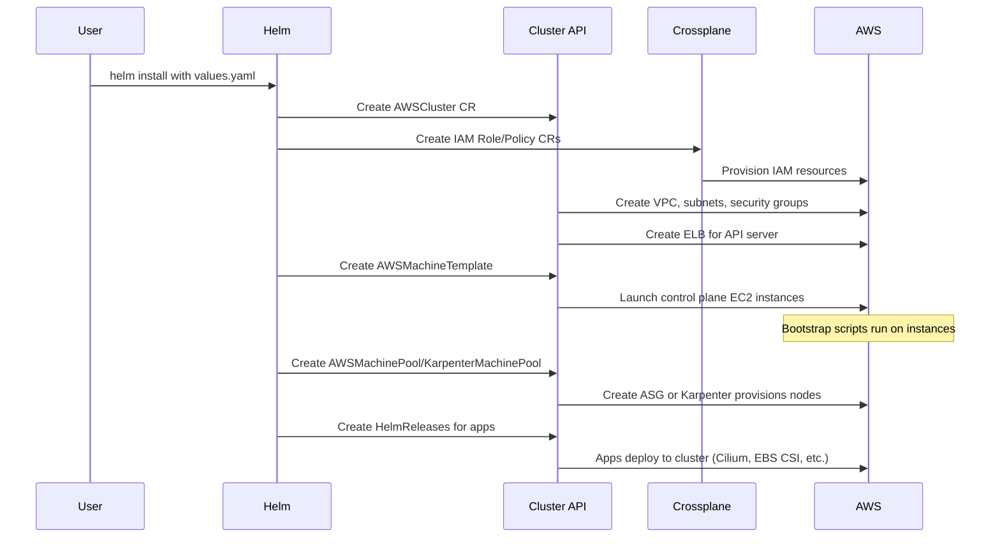
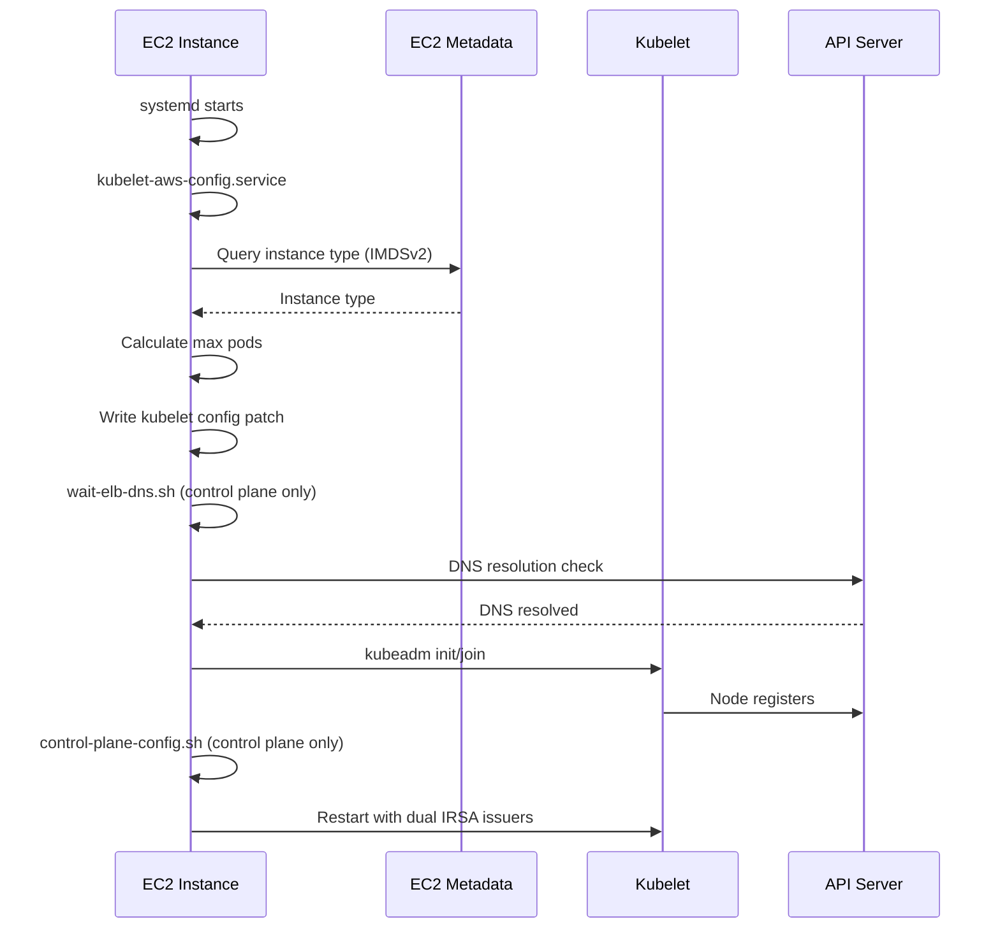

# Codebase Map

> Auto-generated by Cartographer. Last mapped: 2026-01-27

## System Overview



## Directory Structure

```
cluster-aws/
├── .abs/                          # Application Build Suite config
│   ├── ct.yaml                    # Chart-testing repository config
│   └── main.yaml                  # ABS build configuration
├── .circleci/
│   └── config.yml                 # CircleCI chart publishing pipeline
├── .github/
│   ├── workflows/                 # GitHub Actions (CI/CD)
│   │   ├── aws_azs.yaml          # Daily AZ data updates
│   │   └── zz_generated.*.yaml   # Auto-generated validation workflows
│   └── pull_request_template.md  # PR template
├── azs-getter/                    # Go tool for AWS AZ discovery
│   ├── internal/awshelper/       # AWS SDK helper functions
│   ├── main.go                   # CLI entry point
│   ├── go.mod                    # Go module dependencies
│   └── go.sum                    # Dependency checksums
├── helm/cluster-aws/             # Main Helm chart
│   ├── ci/                       # CI test value files
│   ├── files/                    # Node bootstrap scripts/configs
│   │   ├── etc/                  # System configuration files
│   │   └── opt/                  # Bootstrap scripts
│   ├── templates/                # Helm templates
│   │   └── cilium-cleanup/       # ENI cleanup hooks
│   ├── Chart.yaml                # Chart metadata
│   ├── values.yaml               # Default values (generated)
│   ├── values.schema.json        # JSON Schema (source of truth)
│   └── README.md                 # Configuration documentation
├── Makefile                      # Main build entry point
├── Makefile.*.mk                 # Modular make targets
├── CHANGELOG.md                  # Version history
├── README.md                     # Project documentation
└── LICENSE                       # Apache 2.0
```

## Module Guide

### Helm Chart (`helm/cluster-aws/`)

**Purpose**: Core Helm chart that generates Cluster API resources for AWS Kubernetes clusters

**Entry point**: `templates/list.yaml`

**Key files**:
| File | Purpose | Tokens |
|------|---------|--------|
| `values.schema.json` | JSON Schema defining all configuration options | 21,731 |
| `values.yaml` | Default values (auto-generated from schema) | 2,814 |
| `README.md` | Auto-generated configuration documentation | 34,009 |
| `Chart.yaml` | Chart metadata and dependencies | 196 |

**Exports**: Kubernetes Custom Resources (AWSCluster, AWSMachineTemplate, AWSMachinePool, HelmReleases, Apps)

**Dependencies**:
- `cluster` chart v5.1.2 (shared cluster infrastructure)
- `cluster-shared` chart v0.7.1 (common resources)

---

### Helm Templates (`helm/cluster-aws/templates/`)

**Purpose**: Generate Kubernetes manifests for AWS cluster infrastructure

**Key files**:
| File | Purpose | Tokens |
|------|---------|--------|
| `_aws_cluster.tpl` | AWSCluster resource (VPC, subnets, security groups) | 4,139 |
| `_control_plane.tpl` | Control plane AWSMachineTemplate | 958 |
| `_machine_pools.tpl` | Traditional worker node pools | 1,404 |
| `_karpenter_machine_pools.tpl` | Karpenter-managed node pools | 1,481 |
| `_helpers.tpl` | Shared template functions | 1,668 |
| `crossplane-iam-role-*.yaml` | IAM roles via Crossplane | 2,435 |
| `karpenter.yaml` | Karpenter HelmRelease | 1,374 |

**Template Hierarchy**:
```
list.yaml (entry point)
├── _validation.tpl
├── _aws_cluster.tpl
│   ├── _awsregion.tpl
│   ├── _awsazs.tpl
│   └── _helpers.tpl
├── _provider_specific_files.tpl
├── _control_plane.tpl
├── _machine_pools.tpl
└── _karpenter_machine_pools.tpl
```

**Patterns**:
- Immutability via hash suffixes on AWSMachineTemplate
- Conditional rendering based on feature flags
- China region support with different endpoints
- IRSA (IAM Roles for Service Accounts) integration

---

### Bootstrap Scripts (`helm/cluster-aws/files/`)

**Purpose**: Node initialization and configuration scripts deployed to EC2 instances

**Key files**:
| File | Purpose | Tokens |
|------|---------|--------|
| `opt/bin/kubelet-aws-config.sh` | Calculate max pods based on instance type/ENI | 12,140 |
| `opt/bin/wait-elb-dns.sh` | Wait for ELB DNS before kubeadm | 242 |
| `opt/control-plane-config.sh` | Patch kube-apiserver for dual IRSA issuers | 505 |
| `etc/kubernetes/policies/audit-policy.yaml` | API server audit logging policy | 1,329 |

**Bootstrap Flow**:
```
1. System Boot → systemd initialization
2. Network Setup → 99-unmanaged-devices.network (ENI mode)
3. kubelet-aws-config.service → Calculate max pods
4. wait-elb-dns.sh → ELB DNS resolution (control plane)
5. kubeadm init/join → Cluster bootstrap
6. control-plane-config.sh → IRSA issuer patching
```

---

### CI Test Values (`helm/cluster-aws/ci/`)

**Purpose**: Test configurations exercising different chart features

**Key files**:
| File | Purpose | Tokens |
|------|---------|--------|
| `ci-values.yaml` | Base CI configuration | 196 |
| `test-karpenter-full-values.yaml` | Comprehensive Karpenter features | 376 |
| `test-multiple-vpc-cidrs-eni-mode-values.yaml` | Multi-CIDR + ENI networking | 633 |
| `test-network-topology-values.yaml` | Transit Gateway topology | 136 |

**Test Coverage**:
- Networking: ENI mode, multi-CIDR, private VPC, proxy
- Node pools: MachinePool, Karpenter, mixed, spot instances
- Security: auditd, IRSA, service account issuers
- Storage: local registry cache, authenticated mirrors

---

### AZs Getter (`azs-getter/`)

**Purpose**: Go CLI tool that fetches AWS availability zones for all regions

**Entry point**: `main.go`

**Key files**:
| File | Purpose | Tokens |
|------|---------|--------|
| `main.go` | CLI entry point, credential handling | 728 |
| `internal/awshelper/awshelper.go` | AWS EC2 API operations | 445 |
| `go.mod` | Module dependencies | 351 |

**Exports**: YAML file with AZ mappings per region

**Dependencies**: AWS SDK Go v2, gopkg.in/yaml.v3

**Usage**: Automated daily via GitHub Actions (`aws_azs.yaml`)

---

### GitHub Workflows (`.github/workflows/`)

**Purpose**: CI/CD automation for validation, testing, and releases

**Key files**:
| File | Purpose | Tokens |
|------|---------|--------|
| `aws_azs.yaml` | Daily AZ data updates | 986 |
| `zz_generated.create_release.yaml` | Automated release creation | 2,883 |
| `zz_generated.diff_helm_render_templates.yaml` | PR template diff comments | 1,922 |

**Pipeline Structure**:
```
PR Validation:
├── gitleaks (secrets scan)
├── check_values_schema
├── json_schema_validation
├── documentation_validation
├── diff_helm_render_templates
└── validate_changelog

Release (on "Release vX.Y.Z" commit):
├── Create git tag
├── Create GitHub release
├── Create release branch
└── Bump dev version
```

---

## Data Flow

### Cluster Provisioning Flow



### Node Bootstrap Flow



## Conventions

### Naming
- Templates: `_<name>.tpl` for partials, `<name>.yaml` for full resources
- CI values: `test-<feature>-values.yaml`
- Generated workflows: `zz_generated.<name>.yaml`
- Makefiles: `Makefile.<category>.mk`

### Configuration
- Schema-first: `values.schema.json` is source of truth
- Values generated: `values.yaml` auto-generated from schema
- Docs generated: `README.md` auto-generated from schema

### Labels
- `app.kubernetes.io/name`: Chart name
- `app.kubernetes.io/instance`: Release name
- `application.giantswarm.io/team`: Owning team (phoenix)
- `giantswarm.io/prevent-deletion`: Deletion protection

### AWS Tags
- `sigs.k8s.io/cluster-api-provider-aws/cluster/<name>`: Cluster ownership
- `subnet.giantswarm.io/endpoints`: VPC endpoint subnet targeting
- `kubernetes.io/cluster/<name>`: Kubernetes resource ownership

## Gotchas

### Template Immutability
- `AWSMachineTemplate` specs are immutable - changes require new resources
- Templates include content hash in name to force recreation
- Control plane template: `controlplane-awsmachinetemplate-spec`

### ENI Mode Considerations
- Requires `99-unmanaged-devices.network` to prevent systemd managing Cilium ENIs
- Max pods calculated differently (based on ENI/IP limits per instance type)
- Secondary subnets needed for pod IPs
- Cilium cleanup job required before cluster deletion to prevent orphaned ENIs

### China Region Differences
- Different AWS partition (`aws-cn`)
- Different endpoints (`.cn` suffix)
- Different AMI owner account
- S3-based OIDC for IRSA (no public OIDC endpoint)

### IRSA Upgrade Handling
- `control-plane-config.sh` patches kube-apiserver for dual issuer URLs
- Required for v0.38.4+ upgrades where issuer format changed
- Both old (`irsa://...`) and new (`https://irsa://...`) formats accepted

### Instance Type Max Pods
- `kubelet-aws-config.sh` contains 500+ instance type mappings
- Formula: `(MaxENIs - 1) * (IPv4AddrsPerENI - 1)`
- Unknown types default to 40 pods
- Hard limit: 110 pods per node

### Generated Files
- Never edit `values.yaml` directly - edit `values.schema.json`
- Never edit `zz_generated.*.yaml` workflows - managed by devctl
- Never edit `CODEOWNERS` - auto-generated

## Navigation Guide

**To add a new node pool type**:
1. `helm/cluster-aws/values.schema.json` - Add schema definition
2. `helm/cluster-aws/templates/_machine_pools.tpl` or `_karpenter_machine_pools.tpl` - Add template
3. `helm/cluster-aws/ci/test-<feature>-values.yaml` - Add test values

**To add a new managed app**:
1. `helm/cluster-aws/values.schema.json` - Add app config under `global.apps`
2. `helm/cluster-aws/templates/<app>-helmrelease.yaml` - Create HelmRelease template
3. `helm/cluster-aws/templates/_<app>_config.yaml` - Add AWS-specific config (optional)

**To modify AWS networking**:
1. `helm/cluster-aws/templates/_aws_cluster.tpl` - VPC/subnet/security group changes
2. `helm/cluster-aws/templates/_helpers.tpl` - Add helper functions if needed
3. `helm/cluster-aws/ci/test-<network-feature>-values.yaml` - Add test case

**To update bootstrap scripts**:
1. `helm/cluster-aws/files/opt/bin/<script>.sh` - Modify script
2. `helm/cluster-aws/templates/_provider_specific_files.tpl` - Update version suffix if breaking change
3. Note: Changes trigger node rolling updates

**To add AWS region support**:
1. Run `azs-getter` tool or wait for daily automation
2. `helm/cluster-aws/files/azs-in-region.yaml` - Verify AZ data
3. `helm/cluster-aws/templates/_awspartition.tpl` - Add partition handling if needed

**To create a release**:
1. Update `CHANGELOG.md` with changes
2. Create commit with message "Release vX.Y.Z"
3. Push to main branch
4. GitHub Actions handles tag, release, and version bump
